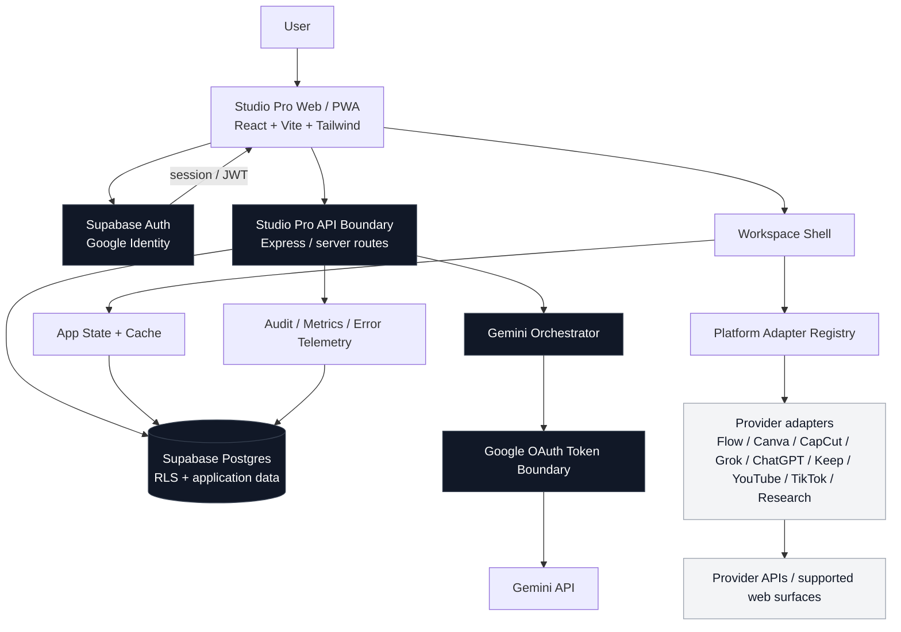
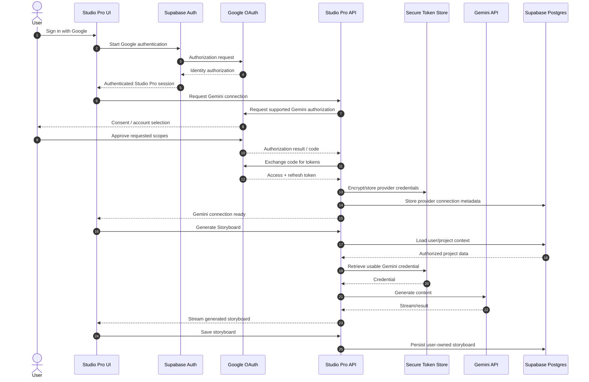
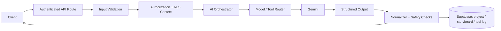
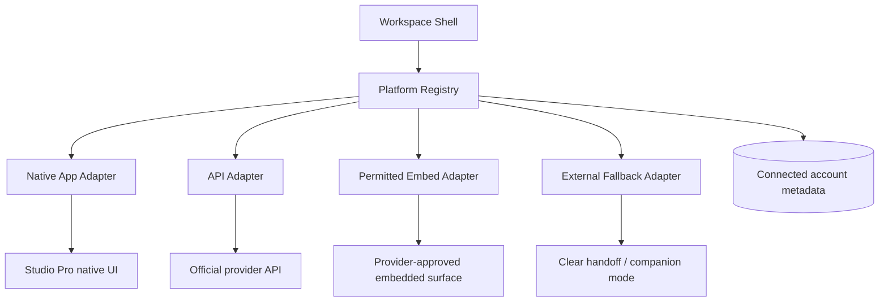

# Studio Pro — Final Workspace Architecture

This document defines the target architecture for the Studio Pro workspace, Google OAuth, Gemini authorization, Supabase data boundaries, and external platform integrations.

> **Architecture principle:** authentication, authorization, credentials, application data, AI orchestration, and third-party platform sessions are separate concerns. The browser never becomes the trust boundary for provider secrets.

## 1. System architecture

### Trust boundaries

1. **Browser:** UI, session-aware requests, non-secret state, workspace presentation.
2. **Supabase Auth:** identity and session issuance.
3. **Server/API:** authorization checks, provider calls, AI orchestration, validation and rate limits.
4. **Supabase Postgres:** user-owned application data protected by RLS.
5. **OAuth token boundary:** encrypted server-side provider credentials; never exposed to client JavaScript.
6. **External providers:** accessed only through supported APIs or permitted web experiences.

## 2. Google login → Gemini authorization flow

Google sign-in proves who the user is. It does **not**, by itself, grant arbitrary Gemini API access. Gemini access must be explicitly authorized through the supported Google authorization flow and scopes, or another supported credential mechanism.

## 3. Storyboard and Microtools request path

The same orchestration layer should serve Storyboard and Microtools so that model selection, structured output, retries, quota handling, logging, and error semantics remain consistent.

## 4. Workspace platform model

Each external platform is represented by an adapter rather than hard-coded directly into the workspace shell.

**Important:** the architecture must not bypass `X-Frame-Options`, CSP `frame-ancestors`, authentication controls, bot protection, or other provider security controls. If a provider forbids framing, the adapter uses an allowed API/native workflow or a transparent fallback experience.

## 5. Supabase data boundary

Recommended logical ownership:

| Data | Owner | Client access | Server-only |
|---|---|---|---|
| Profile | User | Own row | No |
| Storyboards | User | Own rows | No |
| Microtool history | User | Own rows | No |
| Connected account metadata | User | Sanitized metadata | Sensitive credentials |
| OAuth access/refresh tokens | User | Never | Yes |
| Provider client secrets | Application | Never | Yes |
| Rate-limit / audit data | User/application | Sanitized | Sensitive fields as needed |

RLS remains mandatory even when requests also pass through the application server. Server-side authorization is defense in depth, not a replacement for database isolation.

## 6. Production-hardening checklist

- OAuth state validation and PKCE where applicable.
- Least-privilege scopes; request only scopes required for the feature.
- Encrypted provider credentials with rotation/revocation support.
- No secrets in HTML, client bundles, logs, analytics events, or localStorage.
- Strict authorization on every user-owned resource.
- RLS policies that do not allow cross-user reads/writes.
- Server-side input validation and output schema validation.
- SSRF protection for any URL-fetching functionality; do not proxy arbitrary private-network destinations.
- Do not rewrite or strip provider security headers to defeat embedding controls.
- Rate limiting and abuse protection on AI and proxy-capable endpoints.
- Structured audit events without credential contents.
- Retry with bounded backoff for transient provider failures.
- Explicit handling for expired/revoked OAuth grants, quota exhaustion, denied consent, provider downtime and offline mode.
- CSP, secure headers, CSRF protections where cookie-authenticated mutations are used, and dependency scanning.
- Automated unit, integration, E2E, accessibility and security regression tests.

## 7. MVP → production sequence

### MVP

1. Google authentication.
2. Explicit Gemini authorization connection.
3. Secure server-side Gemini call path.
4. Storyboard generation and persistence.
5. Microtools through the shared AI orchestration layer.
6. Workspace shell + adapter registry.
7. Supabase RLS and core data model.
8. Loading, empty, error and auth-expired states.

### Production hardening

1. Token lifecycle and revocation UX.
2. Rate limits and abuse controls.
3. Provider-specific API/embedding capability matrix.
4. Observability and alerting.
5. Comprehensive E2E and accessibility coverage.
6. Performance budgets and Core Web Vitals monitoring.
7. PWA offline strategy that never caches sensitive credentials.
8. Security headers, SSRF defenses and dependency/security automation.
9. Disaster recovery, migration discipline and rollback procedures.
10. Production acceptance test suite.

## 8. Non-negotiable security rule

**Never implement "automatic access" by assuming that a Google login session is equivalent to authorization for every Google product.** Identity and delegated API authorization are separate security decisions.
